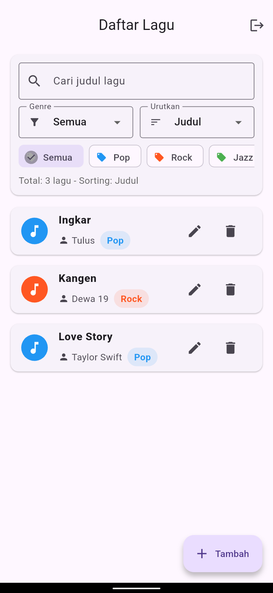
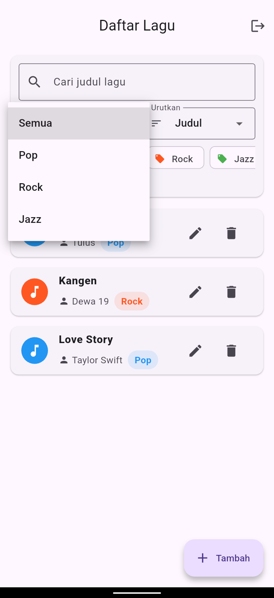
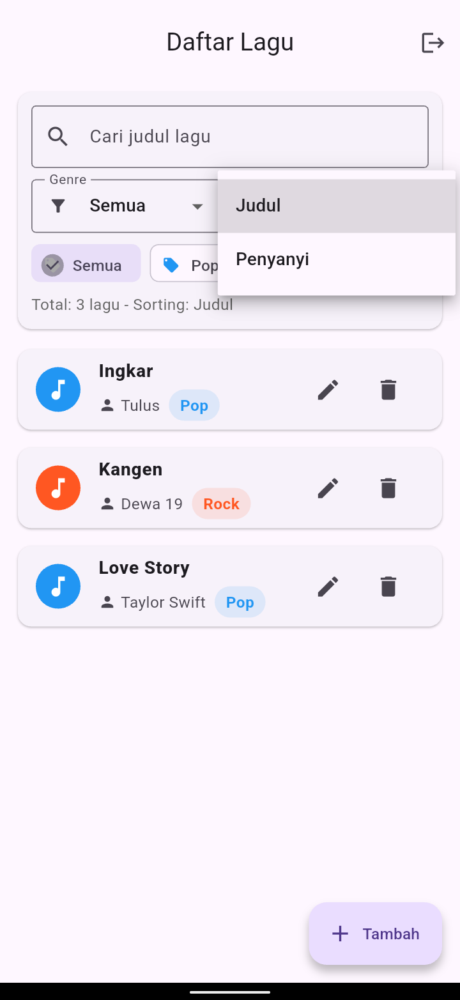
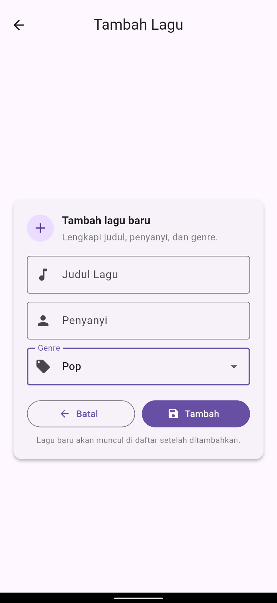
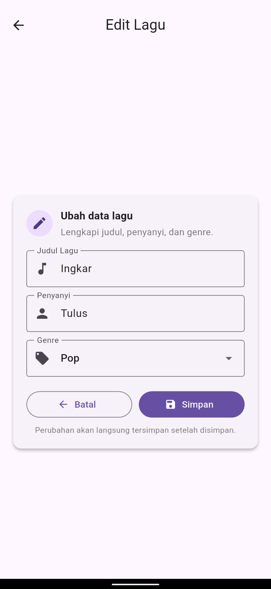

# Sistem Manajemen Lagu (Flutter)

Aplikasi Android sederhana berbasis **Flutter (Dart)** untuk mengelola daftar lagu secara lokal.  
Aplikasi ini dibuat untuk memenuhi **Soal Praktek – Android Programming (Web Developer Test)**.

---

## Deskripsi Aplikasi

**Sistem Manajemen Lagu** adalah aplikasi mobile yang memungkinkan pengguna untuk:
- Login sederhana
- Melihat daftar lagu
- Menambah, mengedit, menghapus lagu
- Mencari, memfilter, dan mengurutkan lagu
- Menyimpan data secara lokal (tetap ada walau aplikasi ditutup)

Aplikasi ini **tidak menggunakan backend / API**, seluruh data disimpan secara lokal menggunakan `shared_preferences`.

---

## Teknologi yang Digunakan

- **Flutter** (Dart)
- **Material Design**
- **shared_preferences** (local storage)
- Platform: **Android**

---

## Fitur Utama

### 1 Login & Session
- Halaman login sederhana
- Validasi login (hardcode)
- Session disimpan menggunakan `shared_preferences`
- Tombol logout untuk menghapus session

**Akun demo:**
> Username : user@demo.com
> 
> Password : 123456


---

### 2 Halaman Daftar Lagu
- Menampilkan daftar lagu dalam bentuk **ListView**
- Setiap lagu menampilkan:
  - Judul Lagu
  - Penyanyi
  - Genre
- Empty state jika belum ada data

**ListView**


---

### 3 Pencarian & Filter
- Pencarian lagu berdasarkan **judul**
- Filter lagu berdasarkan **genre**
- Genre contoh:
  - Pop
  - Rock
  - Jazz

**Filter Genre**


---

### 4 Sorting Lagu
- Urutkan lagu berdasarkan:
  - Judul
  - Penyanyi
- Sorting diletakkan di **panel filter**

**Sorting Lagu**

---

### 5 Tambah, Edit, & Hapus Lagu
- Form input lagu:
  - Judul Lagu (required)
  - Penyanyi (required)
  - Genre (dropdown)
- Edit lagu → data lama otomatis terisi
- Hapus lagu dengan **dialog konfirmasi**
- Snackbar notifikasi untuk setiap aksi

**Tambah Lagu**



**Edit Lagu**



**Hapus Lagu**


---

### 6 Penyimpanan Data Lokal
- Menggunakan `shared_preferences`
- Data lagu **tetap tersedia** walaupun aplikasi ditutup
- Session login juga tersimpan

---

### 7 UI & UX
- Menggunakan Material Design
- Layout rapi dan responsif
- Aman dari overflow (support layar kecil & besar)
- Snackbar custom (floating, icon, warna)

---


## Cara Menjalankan Project

### 1 Clone / Extract Project
```
git clone https://github.com/WayanDev/flutter-song-management.git
cd flutter-song-management
```
### 2 Install Dependency
```
flutter pub get
```
### 2 Install Dependency
```
flutter run
```

